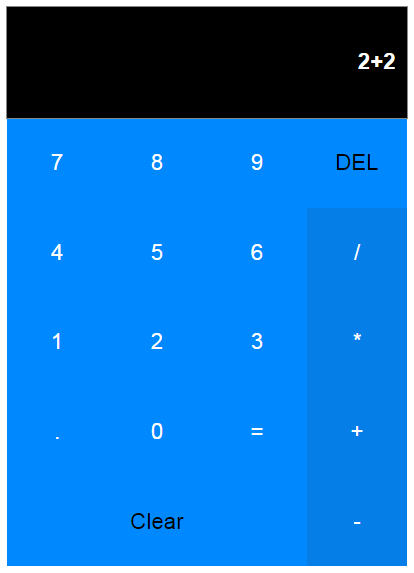

A simple Calculator build using Reactjs framework.
For evaluation [math.js](http://mathjs.org) library is used.




To install all dependency

```sh
$ npm install
```

To run the React Calculator app..

```sh
$ npm start
```

Navigate to 

```
http://localhost:3000/
```

